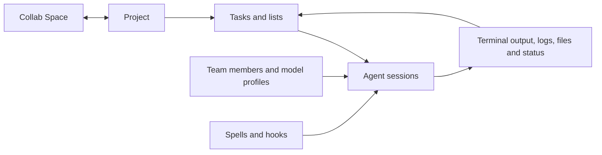

# Product and UX design reference

## Product in one sentence

Agent Maestro is a control room for creating, running, observing, and coordinating multiple AI coding-agent sessions across projects, terminals, tasks, files, teams, and shared collaboration spaces.

## Who it is for

1. **Individual builders** who run several Claude, Codex, Gemini, Hermes, or shell sessions and need one stable workspace.
2. **Technical leads** who decompose work, assign agents, track progress, and inspect output without losing project context.
3. **Distributed teams** who share tasks, documents, files, messages, spells, and presence through Collab Spaces.
4. **Operators** who host a browser-accessible Maestro instance on a workstation, VPS, EC2/Tailscale host, or gateway-managed fleet.

## Core mental model

The user enters a **project**, organizes work as **tasks and task lists**, launches an **agent session** in a real terminal, and watches events flow back into the workspace. **Teams and team members** provide reusable agent identities. **Spells** encode event-driven automation. **Collab Spaces** synchronize selected resources through Firebase without replacing local Maestro storage.

## Information architecture

The primary application shell combines a left navigation/space rail, project and session navigation, a multi-tab workspace, terminal strip, file explorer/editor, task and team surfaces, resource/document viewers, slide panels, command palette, settings, notifications, and collaboration surfaces. The responsive/mobile implementation changes presentation and navigation while preserving the same conceptual objects.

### Primary UI element inventory

- **Navigation:** icon rail, spaces rail, project tab bar, project/session trees, breadcrumbs, mobile panels, command palette.
- **Work surfaces:** terminal, Monaco editor, file explorer, task board/tree, team view, collaboration channels, docs/resources, Excalidraw boards, Mermaid diagrams, session activity and statistics.
- **Creation and editing:** task modal, new-session form, project dialogs, team-member editor, spell studio, environment manager, prompt manager, shortcut editor.
- **Feedback:** toasts, activity indicators, connection state, progress, unread badges, notifications, update banner, loading/empty/error states, confirmation dialogs.
- **System controls:** theme, zoom, terminal settings, display settings, Git settings, startup settings, authentication gates, gateway login.

## Experience principles

1. **Context before control.** Always show the active project, task, session, environment, and connection target before a consequential action.
2. **Progressive disclosure.** Keep frequent actions visible; place advanced orchestration, model, Git, gateway, and deployment options one level deeper.
3. **Recoverability.** Provide undo or confirmation for destructive task/file/Git actions; preserve terminal and editor state when changing views.
4. **Live but calm.** Real-time events should update status without constantly reflowing the interface or stealing focus.
5. **Local-first transparency.** Tell users what is stored locally, what is sent to Firebase, and what runs on a remote host.
6. **Keyboard and pointer parity.** Core workflows must work through shortcuts, menus, focus traversal, and visible controls.
7. **Agent legibility.** Separate what the human requested, what the orchestrator assigned, what the agent is doing, and what evidence proves completion.

## Design-system benchmark

The recommendation is to learn from—not visually clone—these systems. Maestro needs its own recognizable control-room language.

### Apple Human Interface Guidelines

Apply hierarchy, consistency, platform familiarity, user agency, recoverability, and support for multiple input methods. On macOS/iOS, respect native window, keyboard, touch-target, focus, safe-area, Dark Mode, and reduced-motion conventions.

Official references:

- https://developer.apple.com/design/human-interface-guidelines/
- https://developer.apple.com/design/human-interface-guidelines/design-principles
- https://developer.apple.com/design/human-interface-guidelines/accessibility

### Google Material Design 3

Use tokenized color/type/spacing, explicit component states, adaptive layouts, accessible contrast, predictable navigation, and consistent elevation. Material guidance is particularly useful for the browser and Android/mobile surfaces.

Official references:

- https://m3.material.io/
- https://m3.material.io/components
- https://m3.material.io/foundations/accessible-design/overview

### Meta design resources

Use Meta's public resources as examples of cross-platform asset discipline, prototyping, and communication patterns. For collaboration, emphasize clear identity, presence, message state, privacy, and notification controls.

Official reference: https://design.facebook.com/toolsandresources/

### Uber Base design system

Base is a useful benchmark for dense operational software: strong foundations, reusable components, data-rich layouts, clear status color, and consistent iconography across products.

Official references:

- https://base.uber.com/
- https://base.uber.com/6d2425e9f/p/294ab4-base-design-system

## Proposed Maestro design foundations

- **Grid:** 4 px base; common spacing steps 4, 8, 12, 16, 24, 32, 48.
- **Density:** comfortable by default; optional compact density for expert terminal/task use.
- **Typography:** system UI for chrome; monospaced font only for terminal, code, identifiers, commands, and logs.
- **Color:** neutral surfaces with one Maestro accent; semantic colors for success, warning, danger, information, agent state, and connection state. Never convey status by color alone.
- **Icons:** one coherent outline family, 16/20/24 px sizes, optical alignment, text labels for ambiguous actions, and accessible names for icon-only buttons.
- **Motion:** 120–220 ms for local UI transitions; no decorative motion in high-frequency terminal/task updates; honor reduced motion.
- **Targets:** at least 44×44 CSS px for primary touch actions on mobile; do not make dense desktop controls the mobile target size.

## Critical end-to-end UX flows

### Start work

Choose project → choose or create task → select team member/model/agent → review working directory and permissions → launch → terminal becomes active → session and task status update in real time.

### Resume work

Open project → locate recent/in-progress session → inspect last activity and task state → resume/reconnect → confirm stream continuity → continue.

### Share work

Sign in → join/create Collab Space → select resources → share/publish → collaborators receive inbox/push notification according to preferences → adopt or pull resource into local project.

## Accessibility acceptance standard

- All interactive controls have accessible names, visible focus, logical order, and keyboard activation.
- Text and meaningful icons meet WCAG 2.2 AA contrast; status is conveyed by label/icon as well as color.
- Panels remain usable at 200% zoom and with browser text enlargement.
- Terminal/editor shortcuts do not trap focus; an obvious escape returns to application navigation.
- Live updates use restrained announcements; terminal streaming is not dumped indiscriminately into a live region.
- Charts, diagrams, audio cues, and agent-state animations have text alternatives.
- Mobile layouts respect safe areas, orientation, Dynamic Type/font scaling, and reduced motion.

## UX debt visible from the repository

The product has grown faster than its interaction model. There are many overlapping panels, stores, modal flows, and platform-specific pathways. The strongest next UX investment is not a visual reskin; it is a single documented navigation model, a shared component/state specification, and usability testing of the start/resume/share workflows.
