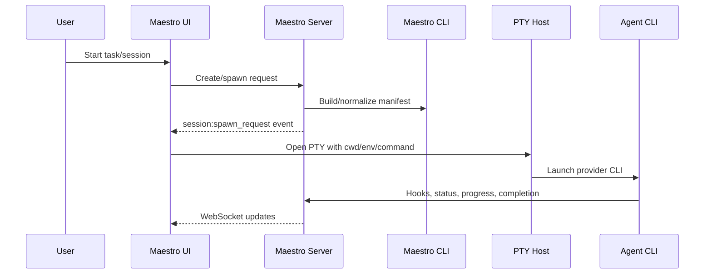

# Functional specification

## 1. Projects and workspace

Projects bind a name and working directory to tasks, sessions, files, prompts, environments, documents, and collaboration context. Users can create, select, rename, synchronize, and remove projects. The application must validate paths, preserve the selected project across restart, and avoid leaking one project's state into another.

**Acceptance:** creating a project makes it immediately selectable; opening it restores its relevant workspace; renaming retains identity and references; removal requires clear confirmation and explains whether local files are untouched.

## 2. Tasks, lists, graphs, and ordering

Tasks support hierarchy, status, priority, dependencies/references, descriptions, assignments, progress, and session linkage. Task lists group work; graph data represents dependencies; ordering endpoints persist user-defined sequence. Optimistic UI updates must reconcile with server events and revert visibly on failure.

**Lifecycle:** draft/backlog → ready → in progress → blocked or completed. Exact stored values remain implementation-defined; the UI must never imply completion without a persisted response or acknowledged event.

## 3. Sessions and agent execution

Sessions represent running or historical agent/shell work. A session captures project, task(s), role, model/member profile, working directory, spawn mode, prompts, status, logs, command usage, and terminal state. The CLI normalizes a manifest, composes identity/task/capability prompts, loads skills, then launches the selected provider adapter (Claude, Codex, Gemini, or Hermes).

Failure handling must distinguish invalid configuration, missing provider executable, manifest failure, PTY failure, disconnected WebSocket, provider exit, and user cancellation. Reconnect must not duplicate output; stream epochs/offsets in the browser path exist to protect continuity.

## 4. Terminal, recording, replay, and logs

The terminal surface uses a real PTY locally through Tauri or remotely through the server `/pty` WebSocket. It supports multiple sessions, resize, input/output streaming, hide/show layout, reconnect, scrollback, recording, replay, activity detection, and agent branding. Historical logs are available through platform-specific APIs.

## 5. Files, editor, documents, and boards

Users can browse approved roots, read/write files, create/rename/delete items, open code in Monaco, view project documents, render Markdown/office content where supported, and use Excalidraw/Mermaid resources. Tauri performs native operations; browser mode uses server filesystem routes confined to server-derived allowlisted roots. SSH operations add remote browsing and transfers.

Destructive file operations require an explicit target and confirmation. Path traversal and symlink escapes must remain blocked server-side, not merely hidden in the client.

## 6. Teams, members, profiles, and ensembles

Teams organize reusable members. Team-member definitions carry role, mode, model, avatar, skills, and orchestration behavior. Model profiles separate provider/model configuration from tasks. Ensembles and huddles coordinate multiple sessions. Assignment and resume behavior must preserve the relationship between task, member identity, and actual session.

## 7. Skills, prompts, hooks, spells, and automation

Skills are discovered from multiple filesystem scopes and ranked for selection. Prompts can be saved and sent to sessions. Hooks receive agent lifecycle events. Spells are multi-rule automations activated against event/matcher conditions with ring/iteration state. Automation must be inspectable: show trigger, action, owner, current state, last run, and failure.

## 8. Git workflows

Git features expose repository status and actions within project context, including branch and pull-request related UI. Any discard/delete/reset-style action must show exact files/branch and never rely only on a generic confirmation. Authentication and network errors need distinct messages.

## 9. Collaboration spaces

Firebase Authentication identifies users. Firestore stores collaboration spaces, membership, channels/messages, shared tasks, files, documents, boards, spells, teams, invitations, notification preferences, and durable inbox items. Realtime Database holds ephemeral presence/focus. Cloud Functions derive events, create per-recipient inbox records, and deliver FCM web push. Firestore/RTDB rules enforce membership, provenance, size limits, owner/admin boundaries, and private invite redemption.

Sharing is selective: local core project data is not automatically migrated into Firebase. Resource adapters publish or adopt specific representations and preserve source/provenance fields.

## 10. Notifications

Users can receive in-app collaboration notifications and optional push. Preferences include all messages versus mentions, desktop enablement, muted spaces, and muted channels. Push is suppressed when the recipient is actively focused on the exact resource/channel. Invalid device tokens are pruned by the function.

## 11. Authentication and security modes

- **Local/Tauri:** trusted local requests can bypass browser password mode under explicit middleware rules.
- **Self-hosted web:** optional password protection uses signed cookie sessions; TLS is mandatory when exposed beyond a trusted local network.
- **Gateway/collaboration:** Firebase identity gates hub/gateway and Collab Space features.

The `/health` endpoint advertises `none`, `password`, or gateway-overridden `firebase` capability so clients can select the correct login flow.

## 12. Gateway and remote access

The gateway authenticates a user, registers/supervises remote Maestro instances, tracks presence/credentials, and proxies API/WebSocket/PTY traffic. A remote instance remains responsible for its own local data and agent processes; the gateway is an access/control layer, not the canonical core datastore.

## 13. Voice/Alexa and announcements

Voice routes accept controlled ingress and announcements through the configured VoiceMonkey/Alexa integration. These features must be opt-in, authenticated, rate-limited, and logged without exposing secrets.

## 14. Deployment and updates

Supported patterns include local staging/prod, single-origin browser hosting, VPS with systemd/nginx/TLS, and EC2/Tailscale. Build steps use Bun where documented, while the production PTY server runs on Node because of node-pty runtime constraints. Deployment must configure data/session directories, auth secrets, allowed origins/CSP, service supervision, and backups.

## Cross-cutting acceptance checks

1. Every mutation returns an explicit success or actionable failure and is reflected consistently after reload.
2. WebSocket reconnect never creates duplicate sessions or duplicated terminal output.
3. Authorization is enforced at server/rules boundaries, not only by UI visibility.
4. Local, staging, production, and collaboration data are visibly distinguishable.
5. Offline or degraded Firebase does not corrupt local core Maestro data.
6. Logs never include passwords, tokens, Firebase credentials, prompt secrets, or environment values by default.
7. Destructive operations identify scope and offer recovery guidance.
