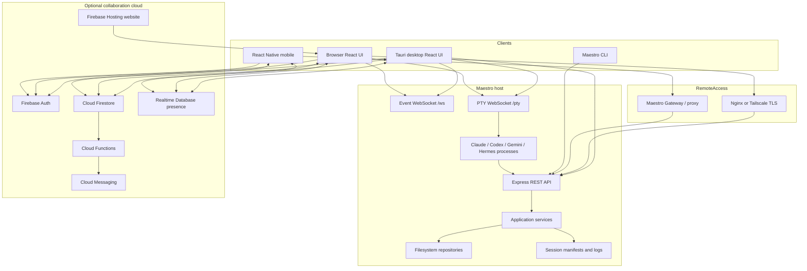
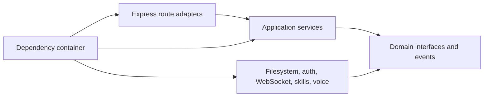

# System architecture

## Executive view

Agent Maestro is a monorepo with four cooperating planes:

1. **Experience plane:** React/Vite UI in Tauri and browser, React Native mobile, website, and CLI.
2. **Orchestration plane:** Express server, application services, event bus, agent manifest/prompt composition, provider launchers, PTY host, REST and WebSocket APIs.
3. **Persistence plane:** local JSON/file repositories for core data and session logs; Firebase services for shared collaboration/presence/notifications.
4. **Access/operations plane:** gateway/proxy, nginx or Tailscale TLS termination, systemd, deployment scripts, Firebase Hosting and Functions.

## Monorepo responsibilities

- `maestro-ui`: React/TypeScript workspace, state stores, platform abstractions, Firebase clients, terminal/editor/task/team/collaboration UI, tests, and Tauri shell.
- `maestro-server`: Express API, clean application/domain/infrastructure layers, filesystem repositories, WebSocket bridges, PTY host, authentication, security headers, Git/filesystem/voice routes.
- `maestro-cli`: command surface, REST client, manifest schema/normalization, prompt composition, permissions, provider-specific spawners, collaboration CLI.
- `maestro-pty-protocol`: shared PTY message contracts.
- `maestro-gateway`: Firebase-authenticated registry, supervisor, credentials, reverse proxy, and remote instance access.
- `maestro-mobile`: mobile access to remote Maestro/gateway and collaboration features.
- `functions`: Firebase Functions v2 notification/event fan-out in `asia-southeast1`.
- `website`: static Firebase Hosting target.
- `deploy`: VPS/EC2 deployment, systemd, nginx, and migration scripts.

## Backend layering

The server follows dependency inversion:

Routes validate HTTP inputs and map results. Services own use-case behavior. Domain interfaces define repositories and events. Infrastructure implements those interfaces with filesystem, WebSocket, skill-loader, auth, Git, and external-service adapters. `container.ts` constructs and initializes the graph and runs controlled migrations.

## Core storage

Core Maestro data is stored beneath `DATA_DIR` as discrete JSON documents through repositories for projects, tasks, task lists, task graphs, sessions, ordering, teams, members, prompts, model profiles, spells, ensembles, clipboard images, prompts, and command usage. Writes use atomic-write and batching utilities. Session manifests/logs are held beneath `SESSION_DIR`.

Advantages are transparency, portability, easy local backup, and no database requirement. Limits are weak multi-process concurrency, expensive global queries, filesystem-dependent integrity, and difficult analytics/migrations at scale.

## Firebase collaboration storage

- **Auth:** Google/Firebase user identity.
- **Firestore:** durable shared resources and notification inboxes with membership-gated rules.
- **Realtime Database:** ephemeral connection, presence, visibility, and focus.
- **Functions:** trigger-derived collaboration notifications and FCM delivery; deterministic inbox IDs make retries idempotent.
- **FCM:** browser/device push delivery with token cleanup.
- **Hosting:** static `website` deployment, not the core Node/Tauri application runtime.

## API and real-time transport

REST endpoints cover projects, tasks, task lists/graphs, sessions/prompts/huddles, skills, ordering, teams/members, profiles, workflow templates, spells, hooks, ensembles, master-project queries, voice, Git, logs, filesystem, clipboard, and auth. `/ws` broadcasts application/domain events. `/pty` is a separate binary/text terminal transport with resize/input/output/reconnect semantics. SSE responses are excluded from compression where used.

## Security boundaries

1. Express security headers and CSP explicitly allow required Firebase, WebSocket, Monaco worker, and deployment origins.
2. CORS allows Tauri, configured origins, and local development origins.
3. Password auth is mounted before the protected API guard; health/capability endpoints remain public.
4. Browser filesystem routes derive allowed roots from server state and home directory.
5. Firestore and RTDB rules enforce identity, membership, ownership/admin roles, immutable provenance, bounded arrays/maps, and strict final-document shapes.
6. Production deployment should terminate TLS before any browser password, cookie, WebSocket, or PTY traffic leaves the host.

## Deployment topologies

### Desktop/local

Tauri hosts native commands and terminal access; Node server runs on an isolated prod or staging port; local JSON/session directories are separated.

### Single-origin browser/VPS

Vite builds static UI → Express serves `maestro-ui/dist` → REST, `/ws`, and `/pty` share the origin → systemd supervises Node → nginx terminates TLS and forwards WebSocket upgrades.

### EC2/Tailscale

Server binds to loopback → Tailscale Serve provides tailnet HTTPS and WebSocket termination → no public nginx exposure is required.

### Gateway/mobile

Firebase-authenticated gateway maps an authorized user to registered remote Maestro instances and proxies supported traffic. Supervisory state and credentials must be isolated from application data.

## Reliability and observability

Current building blocks include health/build information, structured server logging, session logs, agent log routes, command usage, terminal state mirroring, WebSocket status, service supervision, atomic writes, trigger retries, and deterministic notification inbox creation.

Recommended production additions: OpenTelemetry traces, metrics for route/WS/PTY latency and failures, audit logs for destructive/admin actions, backup verification, schema-version metrics, storage integrity checks, rate limiting by identity, and documented recovery objectives.

## Data backup and recovery

Back up `DATA_DIR`, `SESSION_DIR`, gateway credential/registry state, deployment environment files, and Firebase data according to separate retention policies. Never place plaintext auth secrets in repository backups. Test restore into an isolated directory and validate referential integrity before switching traffic.
