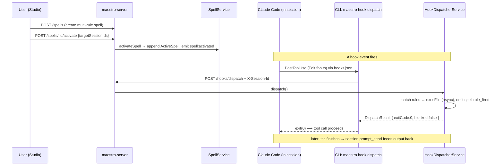

# The Maestro Spell System — Architecture Explainer (v2)

> **Status: current as of 2026-07-04.** Grounded in the shipped `feat/spell-hardening`
> code (off `staging`), not just design docs. Every claim is traceable to a source file
> cited inline as `path:line`. The **authoritative** contract is
> `docs/spell-system-redesign.md` §11; where a design doc and the code disagree, the code
> wins and this document says so.
>
> **This is a v2 rewrite.** The earlier version of this file documented a `gate`/
> single-action model that was **dropped in the v2 clean break**. If you remember spells
> as "one action + a gate that blocks tool calls," that model is gone — read on.

## TL;DR

A **Spell** is a reusable, persisted bundle of **rules** you attach to a running Claude
session. Each rule binds **one Claude hook event → one action**, and rules fire
independently. There is no "block" — the system is **fail-open** by design.

Two distinct mechanisms live under the "spell" umbrella and are easy to conflate:

| | **Spell entity** (the hook system) | **Spell invocation** (legacy "cast a prompt") |
|---|---|---|
| What it is | A first-class `Spell` = **1..20 rules**, each a `{ trigger → action }` bound to a Claude **hook event** | A one-shot prompt built from an **entity** (task/skill/doc/…) via a template |
| Persisted on | `Spell` file in `data/spells/` **+** `Session.activeSpells[]` | Nothing — it fires and forgets |
| Fires when | A matching Claude **hook event** occurs during the session | The moment you invoke it |
| Server entry | `POST /api/spells/:id/activate` → later `POST /api/hooks/dispatch` | `POST /api/spells/invoke` |
| Code owner | `SpellService` (CRUD/activate) + `HookDispatcherService` (fire) | `SpellService.invoke()` |
| Mental model | "**Activate** persistent, event-triggered rules" | "**Cast** a prompt right now" |

Both ultimately deliver text into a session the same way — by emitting a
`session:prompt_send` event on the event bus, or by returning stdout the CLI writes to the
terminal. The difference is *when* and *what triggers* it. **This document is about the
hook system** (the multi-rule `Spell` entity); the invoke path is summarized in §7.

---

## 1. Domain model — what a Spell is

### 1.1 The `Spell` entity (multi-rule)

Defined in `maestro-server/src/types.ts:692`:

```ts
interface Spell {
  id: string;
  name: string;
  description: string;      // human summary ONLY — no longer the injected body
  icon?: string;
  color: SpellColorSlug;    // one of 9 palette slugs — drives the UI rings
  rules: SpellRule[];       // 1..20 rules (validation caps at 20)
  isDefault?: boolean;      // true = curated seed, non-deletable
  createdAt: number; updatedAt: number;
}
```

The single most important v2 change: **a spell is a list of rules, not a single action.**
The old `action` / `trigger` / `failMode` / `maxIterations` / `loopType` fields on the
spell are gone — that behavior now lives *per rule*.

### 1.2 `SpellRule` — one trigger → one action

`types.ts:661`:

```ts
interface SpellRule {
  id: string;              // idGenerator('rule'); stable across edits
  label?: string;          // optional human handle; drives the summary line + reset UX
  enabled: boolean;        // rules toggle independently
  trigger: SpellTrigger;   // WHICH hook event (+ optional matcher) fires it
  action: SpellActionConfig; // WHAT it does when it fires
}
```

A spell with three rules can, e.g., feed context at `SessionStart`, run a command after
edits, and notify on `Stop` — three independent behaviors under one name, each with its
own enable toggle.

### 1.3 `SpellTrigger` — 8 hook events (discriminated union)

`types.ts:640`. A trigger is a discriminated union on `type`:

```ts
type SpellTrigger =
  | { type: 'hook'; hookEvent: SpellHookEvent; matcher?: string }
  | { type: 'schedule'; cron?: string; intervalMs?: number };  // PHASE 2 — see below
```

**`SpellHookEvent`** (`types.ts:626`) — the **8** Claude Code hook events the system binds
(v2 added `SubagentStop` + `SessionEnd`, which have real hook wiring, not just enum
entries):

```
PreToolUse · PostToolUse · UserPromptSubmit · Stop · SubagentStop · Notification · SessionStart · SessionEnd
```

The optional `matcher` is a regex (e.g. `"Bash"`, `"Edit|Write"`) tested against the tool
name (for Pre/PostToolUse) or a payload field. It is validated with `isSafeRegex`
(anti-ReDoS) and capped at 500 chars at save time (`validation.ts:568`), and the *target*
string is capped at 4096 chars at match time.

> **`schedule` triggers are schema-ready but rejected at save in v1.** The Zod
> `superRefine` returns *"Scheduled triggers are not available yet"*
> (`validation.ts:628`). The cron engine is a deferred phase; nothing fires a schedule
> trigger today.

### 1.4 `SpellActionConfig` — 5 actions (discriminated union)

`types.ts:650`. This is the heart of the system. Modelled as a discriminated union on
`type` so the dispatcher switch and the editor config panel narrow exhaustively:

```ts
type SpellActionConfig =
  | { type: 'inject-prompt'; prompt: string }
  | { type: 'feed-context';  prompt: string }
  | { type: 'run-command';   command: string; args?: string[]; cwd?: string; feedOutput?: boolean }
  | { type: 'continue-loop'; loopType?: SpellLoopType; maxIterations?: number }
  | { type: 'notify-channel'; message?: string };   // in-app; see §3.6
```

| Action | What it does on fire | Handler |
|---|---|---|
| `inject-prompt` | Emits `session:prompt_send` — pushes text into the terminal like a UI cast. Returns **no** stdout (avoids double-delivery). | `execInjectPrompt` (`HookDispatcherService.ts:212`) |
| `feed-context` | Returns its `prompt` on **stdout** — Claude reads it as extra context. | `execFeedContext` |
| `run-command` | Runs `command` + `args` via **`execFile`** (no shell). **Async fire-and-forget** — see §3.5. If `feedOutput`, stdout is delivered back later via `session:prompt_send`. | `execRunCommand` |
| `continue-loop` | On `Stop`/`SubagentStop`, tells Claude to keep going (exit 2), bumping a **per-rule** iteration counter up to `maxIterations`. | `execContinueLoop` (`:250`) |
| `notify-channel` | Emits `notify:progress` → an **in-app** notification. | `execNotifyChannel` (`:358`) |

> **There is no `gate` action.** v2 dropped it. The dispatcher has **no block path** —
> `composeResult` never blocks a tool call. See §3.4.

**`SpellLoopType`** (`types.ts:616`): `single-shot | continue-until-done | plan-execute |
critic-refine`. Only meaningful on a `continue-loop` action; it selects the continuation
*nudge text*.

### 1.5 `ACTIONS_BY_EVENT` — the legality matrix

`types.ts:676` is the **single source of truth** for which actions are legal on which
event. It is enforced in the Zod schema (`spellRuleSchema.superRefine`,
`validation.ts:636`) and mirrored in the Studio editor's action dropdown, so an illegal
pairing is both unselectable in the UI and rejected by the server.

```ts
const ACTIONS_BY_EVENT: Record<SpellHookEvent, SpellActionType[]> = {
  PreToolUse:       ['inject-prompt', 'feed-context', 'run-command', 'notify-channel'],
  PostToolUse:      ['inject-prompt', 'feed-context', 'run-command', 'notify-channel'],
  UserPromptSubmit: ['inject-prompt', 'feed-context', 'run-command', 'notify-channel'],
  Stop:             ['inject-prompt', 'feed-context', 'run-command', 'continue-loop', 'notify-channel'],
  SubagentStop:     ['inject-prompt', 'feed-context', 'run-command', 'continue-loop', 'notify-channel'],
  Notification:     ['inject-prompt', 'feed-context', 'run-command', 'notify-channel'],
  SessionStart:     ['inject-prompt', 'feed-context', 'run-command', 'notify-channel'],
  SessionEnd:       ['run-command', 'notify-channel'],   // terminal: no turn left to inject/feed/loop into
};
```

Two rules to internalize: **`continue-loop` is only meaningful on `Stop`/`SubagentStop`**
(elsewhere it would be a no-op, so it's disallowed), and **`SessionEnd` is terminal** —
there is no further model turn to inject or loop into, so only `run-command` and
`notify-channel` are legal there.

### 1.6 `ActiveSpell` — the per-session activation record

`types.ts:712`. This is what lives on `Session.activeSpells[]` and is the **server-side
source of truth** for "which spells are live on this session":

```ts
interface ActiveSpell {
  spellId: string;
  color: SpellColorSlug;              // denormalized for UI rings
  enabled: boolean;
  ruleIterations: Record<string, number>;  // ruleId → loop counter (per-rule now)
  ensembleId?: string;
  castAt: number;
  castBy: string | null;             // session id that cast it, or null for UI
}
```

Note there are **no trigger fields denormalized here** — the dispatcher re-reads the
spell's `rules[]` at fire time, so edits to a spell take effect immediately. The only
per-session runtime state is `ruleIterations` (keyed by `ruleId`, because loops are
per-rule in v2).

### 1.7 The curated library — `SPELL_LIBRARY`

`FileSystemSpellRepository.ts:20` holds the curated seed `Spell`s, all `isDefault: true`
(non-deletable) and merged with user spells at read time (`mergeWithLibrary`). The seed
set is documented in full — name, rules, when to use, why it is safe — in
**`docs/spell-library.md`**. Design rules for seeds: **every `run-command` seed ships
`enabled: false`** (a fresh install never fires a command that may not exist), and
`feedOutput` is off unless the seed needs the output. A seed-contract test
(`test/spell-library-seeds.test.ts`) validates every seed against the real Zod schema.

> Do not confuse `SPELL_LIBRARY` (hook-triggered spells) with the invoke path's
> `SPELL_REGISTRY` + `DEFAULT_SPELL_ENTITIES` templates in `SpellService.ts` — those
> belong to the "cast a prompt" mechanism (§7), not the hook system.

---

## 2. Persistence & the server surface

### 2.1 `FileSystemSpellRepository`

`infrastructure/repositories/FileSystemSpellRepository.ts`:
- User-created spells live as `data/spells/<id>.json` (atomic writes).
- `findAll()` **merges** on-disk spells with the `SPELL_LIBRARY` seeds; a user spell with
  the same id overrides a seed without forking code.
- Delete is guarded: seed ids and any `isDefault` spell throw `ValidationError`.
- `update()` force-preserves `isDefault` and `createdAt` so a copy can't promote itself
  to a protected seed.

### 2.2 REST routes

**`/api/spells`** (`api/spellRoutes.ts`) — CRUD + activation:
| Method / path | Purpose |
|---|---|
| `GET /spells` | list curated + user spells (merged) |
| `POST /spells` | create (`createSpellSchema`, `validation.ts:646`) — `rules` array, 1..20 |
| `PUT /spells/:id` | update (`updateSpellSchema`) |
| `DELETE /spells/:id` | delete (guarded for seeds/`isDefault`) |
| `POST /spells/:id/activate` | body `{ targetSessionIds[], invokerSessionId? }` |
| `POST /spells/:id/deactivate` | body `{ targetSessionIds[] }` |
| `POST /spells/:id/reset-loop` | body `{ sessionId, ruleId? }` — zero per-rule loop counters (`:227`) |

**`/api/hooks/dispatch`** (`api/hookRoutes.ts:16`): the single endpoint every Claude hook
hits. A **self-only guard** requires the `X-Session-Id` header to equal `body.sessionId`
(`403 hook_self_only` otherwise) so one session cannot drive another's side effects.

All inputs are validated with Zod in `api/validation.ts`.

### 2.3 Events

The server never talks to the UI directly — it emits on `IEventBus` and the
`WebSocketBridge` fans events to subscribed clients. Spell-related events:
- `session:prompt_send` — the **delivery** event (inject-prompt, run-command feedback, and
  invoke all use it).
- `spell:activated` / `spell:deactivated` — add/remove an active-spell ring on a session.
- `spell:rule_fired` — per-rule fire receipt `{ sessionId, spellId, ruleId, event, action,
  outcome }`, so silent failures become observable. Bypasses WS batching (immediate).
- `spell:loop_reset` — emitted by the reset-loop endpoint (immediate).
- `notify:progress` — the `notify-channel` action's output (in-app; §3.6).

---

## 3. Hooks — how spells fire on Claude Code events

### 3.1 Static wiring, dynamic behavior

The key principle: **the hook bindings are fixed; the behavior is dynamic.** Every worker
session is spawned with `--plugin-dir .../plugins/maestro-worker`, whose
`hooks/hooks.json` binds **each** of the 8 hook events once to
`maestro hook dispatch <EVENT>` (identical bindings in `plugins/maestro-orchestrator`).
The server decides at *dispatch time* what — if anything — happens, based on the session's
`activeSpells`. You never rewrite `hooks.json` to add a spell; you activate the spell and
the already-bound dispatch call starts matching it.

### 3.2 The CLI hook shim — `maestro hook dispatch <event>`

`maestro-cli/src/commands/hook.ts`. Deliberately dumb:
1. Validate the event is one of the 8 known events (`HOOK_EVENTS`, `:8`); unknown → exit 0.
2. Drain the hook payload JSON from stdin, parse it.
3. If no `MAESTRO_SESSION_ID` or server URL → exit 0 (graceful degrade).
4. `POST /api/hooks/dispatch` with `{ sessionId, event, payload }` and an `X-Session-Id`
   header, **4 s** timeout (`HOOK_REQUEST_TIMEOUT_MS`).
5. Fold the `DispatchResult` into a process outcome (§3.4).
6. Server unreachable / non-2xx → **fail open**, exit 0.

### 3.3 The dispatch engine — `HookDispatcherService.dispatch()`

`application/services/HookDispatcherService.ts:58`:
1. Load the session; iterate `activeSpell → spell.rules`.
2. Keep enabled **`hook`-type** rules whose `hookEvent` equals the fired event and whose
   `matcher` matches. (`schedule` rules are skipped entirely.)
   - Matcher target: for Pre/PostToolUse it's `payload.tool_name`; otherwise it prefers
     `matcherTarget`/`path`/`file_path`/`message`, falling back to the JSON-stringified
     payload; capped at 4096 chars.
   - Match uses `RegExp` (falling back to substring-contains on an invalid regex).
3. Execute each matched rule's action (`executeRuleAction`, `:176`) — the switch from §1.4.
4. `composeResult` folds all per-rule outcomes into one `DispatchResult` (§3.4).

### 3.4 `DispatchResult` and the exit-code contract

`types.ts:836`:

```ts
interface DispatchResult {
  exitCode: 0 | 2;   // 0 = allow, 2 = continue-loop
  stdout: string;    // concatenated feed-context payloads
  reason?: string;   // loop continue reason
  blocked: boolean;  // ALWAYS false in v2 (gate dropped) — retained for wire compat
  continued: boolean;
  spells: HookDispatchSpellOutcome[];
  timestamp: number;
}
```

Composition (`types.ts:804`):
- **feed-context** stdout is concatenated across all fired rules (`join('\n\n')`), exit 0.
- **continue-loop** signals compose by *"any continue wins"* — but **only on
  `Stop`/`SubagentStop`**, where exit 2 tells Claude to keep going. On any other event a
  continue would *block*, so it is downgraded to exit 0.
- **run-command / notify-channel** side effects all execute and accumulate.
- **There is no block path.** `blocked` is permanently `false`. On an internal rule error
  the rule is skipped (**fail-open**) and the error is surfaced for logging; other rules
  continue. `blocked` survives only as a wire-compat field the CLI still reads.

The CLI folds this into: print `stdout`; if `exitCode === 2`, write `reason` to stderr and
`exit(2)` (a *continue* on Stop/SubagentStop); else `exit(0)`.

### 3.5 `run-command` is async fire-and-forget

This is the v2 flagship fix. Hook dispatch is synchronous and the CLI aborts the HTTP
request at **4 s**, but a real `lint`/`test`/`tsc` command can run far longer. So
run-command is **decoupled**: the dispatcher kicks off `execFile` (no shell expansion),
contributes **nothing** to the synchronous exit code / stdout, and — if `feedOutput` is
set — delivers the command's stdout back **asynchronously** via `session:prompt_send` once
it finishes. Command latency never starves the 4 s hook budget.

`feedOutput` defaults **false**. `cwd` defaults to the session's working directory.
Production hardening adds permission gating and a concurrency ceiling around this exec path
(tracked separately); the seed library keeps every run-command rule `enabled: false` by
default so nothing runs until a human wires it to a real command.

### 3.6 `notify-channel` is in-app only

`notify-channel` emits `notify:progress`, which the UI delivers as an **in-app**
notification. There is **no external relay** (no Telegram/Slack/OpenClaw) — that was
scoped out. The action's config is just an optional `message`.

> **The `channel` field is being removed.** Earlier schemas carried an optional `channel`
> routing hint that no relay ever consumed — a dead promise. Per the hardening contract
> (`spell-system-architecture-review-2026-07-04.md` §4/C3) it is dropped from the v1
> action union; **do not author spells that set `channel`.** notify-channel means "show an
> in-app notification," nothing more.

### 3.7 Per-rule loops and reset

`continue-loop` reads/bumps `activeSpell.ruleIterations[rule.id]` (per-rule, not
per-spell) and stops continuing once `maxIterations` is reached — so a `critic-refine`
loop with `maxIterations: 3` self-critiques at most 3 times. To restart a loop mid-session,
`POST /api/spells/:id/reset-loop { sessionId, ruleId? }` zeros the counter(s) and emits
`spell:loop_reset`. Omitting `ruleId` resets all of the spell's loops on that session.

---

## 4. Activation

- `activateSpell(spellId, targetSessionIds, castBy)` builds an `ActiveSpell` (with
  `ruleIterations: {}`) and appends it to each `Session.activeSpells`, emitting
  `spell:activated`. **Idempotent**: re-casting an already-active spell replaces the record
  but **preserves `ruleIterations` for rule ids that are unchanged** — so re-casting
  doesn't reset live loop counters.
- `updateSpell` reconciles `ruleIterations` on every active session, dropping counters for
  rule ids that no longer exist (GC).
- **Auto-activation at spawn:** when a worker boots, `spell-auto-activator.ts` reads
  `manifest.spells` (resolved from the task's `spellIds`) and activates each on the new
  session — so a task can carry "spells on spawn" that are live before the agent types.

---

## 5. The Spell Studio (UI)

The live authoring + activation surface is the **Spell Studio** (`components/spells/
studio/`), opened with **Cmd/Ctrl+Shift+S**. It contains the rule-list editor (per-rule
trigger + action, with the action dropdown filtered by `ACTIONS_BY_EVENT`), the library,
the active-spells view (rings + per-rule reset), and the real-time `SpellActivityFeed` that
renders `spell:rule_fired` / `spell:loop_reset` events. A `run-command` rule shows a
"⚠ runs shell commands" confirmation before save, and `feedOutput` is unchecked by default.

Stores: `useSpellStudioStore`, `useSpellLibraryStore`, `useSpellActivationStore`,
`useActiveSpellsStore`. The cast is optimistically fired by `useSpellActivationStore`, but
the canonical active-spell state only updates when the server's `spell:activated` WS event
round-trips into `useActiveSpellsStore`.

---

## 6. End-to-end example (v2)

**Scenario:** a "Type-Safety Sentinel" spell runs `tsc --noEmit` after every `.ts` edit and
feeds any errors back to the agent.

1. **Create** — in the Studio, one rule:
   `{ enabled: true, trigger: { type:'hook', hookEvent:'PostToolUse', matcher:'Edit|Write' },
   action: { type:'run-command', command:'npx', args:['tsc','--noEmit'], feedOutput:true } }`.
   → `POST /api/spells` → `createSpellSchema` validates the rule (action legal for
   `PostToolUse` ✓, matcher safe ✓) → written to `data/spells/spell_xxx.json`.
2. **Activate** — cast on the worker session → `POST /api/spells/spell_xxx/activate` →
   `ActiveSpell` appended to `Session.activeSpells`, `spell:activated` emitted → a ring
   appears on the session tile.
3. **Agent edits a file** — Claude calls `Edit` on `foo.ts`. Claude Code's **PostToolUse**
   hook fires → `maestro hook dispatch PostToolUse` pipes `{ tool_name:'Edit', … }` on
   stdin.
4. **Dispatch** — the shim POSTs `/api/hooks/dispatch` with `X-Session-Id`.
   `HookDispatcherService`: the rule matches (`Edit` matches `Edit|Write`), so it
   **kicks off `execFile('npx', ['tsc','--noEmit'])`** and returns immediately — exit 0,
   no blocking. `spell:rule_fired` is emitted.
5. **Feedback lands later** — when `tsc` finishes (which may be well past the 4 s hook
   budget), because `feedOutput` is on, its output is delivered via `session:prompt_send`
   and appears in the terminal for the agent to react to.

*(If instead this were a `Stop`-triggered `continue-loop` critic rule, step 4 would return
`exitCode 2` with a "critique and refine" reason and Claude would keep working for another
iteration — until `ruleIterations[ruleId] > maxIterations`.)*



---

## 7. The other mechanism — spell **invocation** (cast a prompt)

Separate from the hook system, `SpellService.invoke()` powers `POST /api/spells/invoke`:
resolve an **entity** (task/skill/doc/session/team-member/custom-prompt), interpolate a
named template (`SPELL_REGISTRY` — `send`/`refer`/`execute`/…), and fan out one
`session:prompt_send` per target. This is a one-shot "hand this context to a sibling
session now" — it fires and forgets, persists nothing, and has **no trigger**. Agents reach
it via `maestro spell invoke <entityId> <spellName> --type <t> --targets <ids>`. It shares
vocabulary and the `session:prompt_send` delivery channel with the hook system but is
otherwise independent. The legacy `docs/spells-*-design.md` files describe *this* path (and
are marked superseded).

---

## Appendix: file map

| Concern | File |
|---|---|
| Domain types | `maestro-server/src/types.ts` (`Spell:692`, `SpellRule:661`, actions `:650`, `ACTIONS_BY_EVENT:676`, `ActiveSpell:712`, hook protocol `:796`) |
| CRUD + activate service | `maestro-server/src/application/services/SpellService.ts` |
| Hook dispatch engine | `maestro-server/src/application/services/HookDispatcherService.ts` |
| Seed library | `maestro-server/src/infrastructure/repositories/FileSystemSpellRepository.ts` (documented in `docs/spell-library.md`) |
| REST routes | `api/spellRoutes.ts`, `api/hookRoutes.ts` |
| Zod validation | `api/validation.ts` (`createSpellSchema:646`, `spellRuleSchema:621`, `ACTIONS_BY_EVENT` superRefine `:636`) |
| CLI hook shim | `maestro-cli/src/commands/hook.ts` (`HOOK_EVENTS:8`) |
| Auto-activate at spawn | `maestro-cli/src/services/spell-auto-activator.ts` |
| Hook bindings (static) | `maestro-cli/plugins/{maestro-worker,maestro-orchestrator}/hooks/hooks.json` |
| Spell Studio (UI) | `maestro-ui/src/components/spells/studio/*` (Cmd/Ctrl+Shift+S) |
| Authoritative design | `docs/spell-system-redesign.md` §11 |

> **Two mechanisms, one name.** When someone says "spell," disambiguate: are they
> **casting** a prompt (`invoke`, one-shot, template) or **activating** a multi-rule
> hook-triggered behavior (`activate` → `HookDispatcherService`)? The two share vocabulary,
> the Studio UI surface, and the `session:prompt_send` delivery event, but are otherwise
> independent.
</content>
</invoke>
