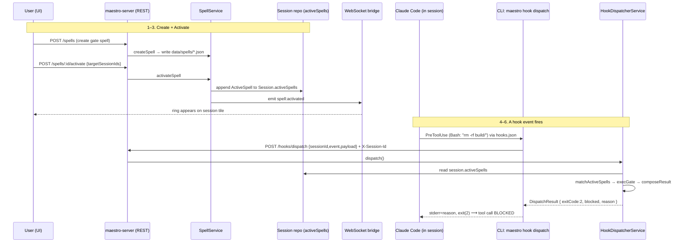

# The Maestro Spell System — Architecture Explainer

> Grounded in the actual `staging` code (not just design docs). Every claim below is
> traceable to a source file cited inline as `path:line`. Design docs under
> `docs/spell-system-design/` describe intent; where the code diverges, the code wins
> and this document says so.

## TL;DR

A **Spell** is a reusable, persisted behavior you attach to a running Claude session.
There are really **two distinct mechanisms** that both live under the "spell" umbrella,
and they are easy to conflate:

| | **Spell entity** (P1–P4, "the spell system") | **Spell invocation** (legacy "cast a prompt") |
|---|---|---|
| What it is | A first-class `Spell` with an `action` + a `trigger` bound to a Claude **hook event** | A one-shot prompt built from an **entity** (task/skill/doc/…) via a template |
| Persisted on | `Spell` file in `data/spells/` **+** `Session.activeSpells[]` | Nothing — it fires and forgets |
| Fires when | A Claude **hook event** (`PreToolUse`, `Stop`, …) occurs during the session | The moment you invoke it |
| Server entry | `POST /api/spells/:id/activate` → later `POST /api/hooks/dispatch` | `POST /api/spells/invoke` |
| Code owner | `SpellService` (CRUD/activate) + `HookDispatcherService` (fire) | `SpellService.invoke()` |
| Mental model | "**Activate** a persistent, event-triggered rule" | "**Cast** a prompt right now" |

Both ultimately deliver text into the session the same way: by emitting a
`session:prompt_send` event on the event bus (or by returning stdout that the CLI
writes to the terminal). The difference is *when* and *what triggers* it.

---

## 1. Domain model — what a Spell is

### 1.1 The `Spell` entity

Defined in `maestro-server/src/types.ts:642`:

```ts
interface Spell {
  id: string;
  name: string;
  description: string;          // doubles as the injected prompt body (see §3.4)
  icon?: string;
  color: SpellColorSlug;        // one of 9 palette slugs — drives the UI rings
  action: SpellAction;          // WHAT it does when it fires
  loopType?: SpellLoopType;     // shape of a continue-loop
  trigger?: SpellTrigger;       // WHICH hook event + matcher fires it
  failMode?: SpellFailMode;     // 'open' (skip on error) | 'closed' (block on error)
  maxIterations?: number;       // cap for loops/gates
  skillRef?: string;            // optional pointer to a skill markdown file
  isDefault?: boolean;          // true = curated seed, non-deletable
  createdAt: number; updatedAt: number;
}
```

**`SpellAction`** — the frozen taxonomy (`types.ts:604`) is the heart of the system.
When a spell fires, `HookDispatcherService.executeAction()` switches on it:

| Action | What it does on fire | Handler |
|---|---|---|
| `inject-prompt` | Emits `session:prompt_send` — pushes text into the terminal like a UI cast | `execInjectPrompt` (`HookDispatcherService.ts:208`) |
| `feed-context` | Returns text on **stdout** — Claude reads it as extra context | `execFeedContext` (`:235`) |
| `gate` | **Blocks** the tool call (exit 2 + stderr reason) | `execGate` (`:243`) |
| `continue-loop` | On `Stop`, tells Claude to keep going (exit 2), bumping an iteration counter | `execContinueLoop` (`:262`) |
| `run-command` | Runs a shell command via `execFile` (currently only if the spell carries a `command` field; otherwise a no-op pass-through, to avoid arbitrary code exec) | `execRunCommand` (`:295`) |
| `notify-channel` | Emits `notify:progress` — relayed to Telegram/Slack/etc. | `execNotifyChannel` (`:336`) |

**`SpellLoopType`** (`types.ts:613`): `single-shot | continue-until-done | plan-execute
| critic-refine`. Only meaningful for `continue-loop` actions; it selects the
continuation *nudge text* in `loopContinuationReason()` (`HookDispatcherService.ts:364`).

**`SpellHookEvent`** (`types.ts:620`): `PreToolUse | PostToolUse | UserPromptSubmit |
Stop | Notification | SessionStart` — the six Claude Code hook events the system binds.

**`SpellTrigger`** (`types.ts:628`): `{ hookEvent, matcher?, enabled }`. The `matcher` is
a regex (e.g. `"Bash"`, `"Edit|Write"`) tested against the tool name (for
Pre/PostToolUse) or a payload field.

**`SpellFailMode`** (`types.ts:635`): `'open' | 'closed'`. On an internal error inside a
spell's action: `closed` = treat as a block (fail-safe for gates); `open` = skip the
spell, let others run (the default).

**`SpellColorSlug`** (`types.ts:591`): 9 fixed palette slugs (`amber`, `rose`, `violet`,
`sky`, `emerald`, `fuchsia`, `lime`, `cyan`, `indigo`) each with a hex. Denormalized onto
`ActiveSpell.color` so the UI can render concentric "rings" on session tiles without a
second lookup.

### 1.2 `ActiveSpell` — the per-session activation record

`types.ts:667`. This is what actually lives on `Session.activeSpells[]` and is the
**server-side source of truth** for "which spells are live on this session":

```ts
interface ActiveSpell {
  spellId: string;
  color: SpellColorSlug;   // denormalized for UI rings
  enabled: boolean;
  hookEvent?: SpellHookEvent;  // copied from the spell's trigger at activation
  matcher?: string;            // copied from the spell's trigger
  iteration: number;           // loop counter, bumped by continue-loop
  ensembleId?: string;
  castAt: number;
  castBy: string | null;       // session id that cast it, or null for UI
}
```

### 1.3 The two "libraries" — curated seeds vs. entity templates

There are **two independent catalogs** in this codebase, which is a common source of
confusion:

1. **`SPELL_LIBRARY`** — 9 curated seed `Spell` entities
   (`FileSystemSpellRepository.ts:16`). These are the real hook-triggered spells:
   `Guardian` (gate Bash), `Test Sentinel`, `Self-Critic` (critic-refine loop),
   `Plan-First`, `Progress Pulse`, `Context Primer`, `Lint-on-Edit`, `Notify-on-Done`,
   `Scope Keeper`. All `isDefault: true` → non-deletable.

2. **`SPELL_REGISTRY` + `DEFAULT_SPELL_ENTITIES`** — the *invocation* templates
   (`SpellService.ts:30` and `:167`). These are `SpellDefinition`s (`send`, `void`,
   `refer`, `execute`, `adopt`, `apply`, `review`, …) with `promptTemplate` strings, plus
   a big set of canned "default entities" (Sprint Planning, Break Down into Subtasks,
   Bug Triage, Refactor, Write Tests, …). These belong to the **invoke** path, not the
   activate/hook path.

### 1.4 `SpellEntityType` & the invocation types

`SpellEntityType` (`types.ts:706`): `maestro | skill | team-member | task | doc | session
| custom-prompt`. Anything you can turn into a prompt is an "entity". `SpellDefinition`
(`:708`) = a named template for an entity type. `SpellInvocationPayload` (`:727`) and
`SpellInvocationResult` (`:743`) drive `POST /api/spells/invoke`.

### 1.5 Hook-dispatch protocol types

`HookDispatchPayload` (`types.ts:773`), `HookDispatchSpellOutcome` (`:780`), and
`DispatchResult` (`:793`) form the wire contract between the CLI hook shim and the
server. The header comment at `types.ts:753` documents the composition rules precisely
(see §3.3).

### 1.6 Ensembles

`Ensemble` (`types.ts:810`) is the P4 multi-session coordination unit: a named group of
`memberSessionIds` with an `objective`, an optional `leaderSessionId`, and the
"coordinate" `spellId` that wires them. Repository interface `IEnsembleRepository`;
service `EnsembleService`; routes under `/api/ensembles`.

### 1.7 UI mirror types

The UI redeclares these in `maestro-ui/src/app/types/maestro.ts` — `Spell` (`:899`),
`CreateSpellPayload` (`:929`), `UpdateSpellPayload` (`:942`), `SpellColorSlug` (`:855`),
`SpellLoopType` (`:867`). They mirror the server shapes so the Zustand stores stay typed.

---

## 2. Server side

### 2.1 `SpellService` (`application/services/SpellService.ts`)

Two responsibilities living in one service:

**A. Invocation path (legacy cast):**
- `getSpellDefinitions(entityType?)` — returns `SPELL_REGISTRY` entries.
- `listEntities(type, projectId)` (`:466`) — enumerates real project entities (tasks,
  team members, skills via `ISkillLoader`, sessions, docs) **plus** the hardcoded
  `DEFAULT_SPELL_ENTITIES` and user custom prompts.
- `resolveEntity(type, id, projectId)` (`:625`) — hydrates the entity's data object.
- `interpolateTemplate()` (`:747`) — a `{{key}}` / `{{key || fallback}}` substituter.
- `invoke(payload)` (`:758`) — resolves targets → resolves entity once → picks the
  spell definition (default `send`) → interpolates → fans out one
  `session:prompt_send` per target → emits `spell:invoked` per target for UI feedback.
  This is the **single delivery path**; the design note at `:781` calls out that it was
  unified to kill an old double-inject bug.

**B. Spell-entity path (activate/hook):**
- `listSpells / getSpell / createSpell / updateSpell / deleteSpell` — CRUD delegating to
  `ISpellRepository`.
- `activateSpell(spellId, targetSessionIds, castBy)` (`:885`) — the pivotal method. For
  each target session it builds an `ActiveSpell` (copying `hookEvent`/`matcher` from the
  spell's trigger, `iteration: 0`), writes it onto `Session.activeSpells` via
  `sessionRepo.update()`, and emits `spell:activated`. **Idempotent**: re-activating an
  already-active spell replaces it rather than duplicating (`:903`).
- `deactivateSpell(spellId, targetSessionIds)` (`:930`) — filters the spell out of each
  session's `activeSpells` and emits `spell:deactivated`.
- Custom-prompt CRUD (`createCustomPrompt`, etc.) with a `default_`-id deletion guard
  (`:984`).

### 2.2 Persistence — `FileSystemSpellRepository`

`infrastructure/repositories/FileSystemSpellRepository.ts`. Key behaviors:
- User-created spells live as `data/spells/<id>.json` (atomic writes, `:255`).
- `findAll()` **merges** the on-disk spells with the 9 `SPELL_LIBRARY` seeds
  (`mergeWithLibrary`, `:212`) — a user spell with the same id *overrides* a seed
  without forking code.
- Delete is guarded: seed ids (`SEED_IDS`, `:150`) and any `isDefault` spell throw
  `ValidationError` (`:291`). `update()` also force-preserves `isDefault` and `createdAt`
  (`:274`) so a copy can't promote itself to a protected seed.
- In-memory `cache` map; `Session.activeSpells` itself is persisted by the **session**
  repository, not here.

### 2.3 REST routes

**`/api/spells`** (`api/spellRoutes.ts`):
| Method / path | Purpose |
|---|---|
| `GET /spells/definitions` | invocation templates (`SPELL_REGISTRY`) |
| `GET /spells/entities/:type` | list entities for the invoke picker |
| `POST /spells/invoke` | fire a one-shot cast |
| `GET/POST/PUT/DELETE /spells/custom-prompts[...]` | custom prompt CRUD |
| `GET /spells` | list curated + user spells (merged) |
| `GET /spells/:id` | one spell |
| `POST /spells` | create custom spell (`createSpellSchema`, `validation.ts:574`) |
| `PUT /spells/:id` | update |
| `DELETE /spells/:id` | delete (guarded for seeds) |
| `POST /spells/:id/activate` | body `{ targetSessionIds[], invokerSessionId? }` |
| `POST /spells/:id/deactivate` | body `{ targetSessionIds[] }` |

**`/api/hooks/dispatch`** (`api/hookRoutes.ts`): the single endpoint every Claude hook
hits. Notable: an **inter-session isolation guard** (`hookRoutes.ts:23`) requires the
`X-Session-Id` header to equal `body.sessionId` — so one session cannot drive another
session's gate/loop/inject side effects (`403 hook_self_only` otherwise).

**`/api/ensembles`** (`api/ensembleRoutes.ts`): `GET /ensembles`, `GET /:id`,
`POST /ensembles`, `PUT /:id`, `POST /:id/members`, `DELETE /:id/members/:sessionId`,
`POST /:id/disband`, `POST /:id/message` (broadcasts to every member session).

All inputs are validated with Zod schemas in `api/validation.ts`
(`createSpellSchema:574`, `updateSpellSchema:587`, `spellActivationSchema`,
`hookDispatchSchema`, `invokeSpellSchema`, etc.).

### 2.4 Event-bus / WebSocket dispatch

The server never talks to the UI directly — it emits on `IEventBus`, and the
`WebSocketBridge` fans events to subscribed clients. Spell-related events:

- `session:prompt_send` — the **delivery** event (inject-prompt & invoke both use it).
  The UI/PTY host writes the `content` to the target terminal.
- `spell:invoked` — per-target UI feedback (ring pulse / toast), never PTY.
- `spell:activated` / `spell:deactivated` — tell the UI to add/remove an active-spell
  ring on a session.
- `notify:progress` — the `notify-channel` action's output, picked up by the channel
  relay.

---

## 3. Hooks — how spells fire on Claude Code events

### 3.1 Static wiring, dynamic behavior

The key design principle: **the hook bindings are fixed; the behavior is dynamic.**

Every worker session is spawned with `--plugin-dir .../plugins/maestro-worker`, whose
`hooks/hooks.json` binds **each** hook event once to `maestro hook dispatch <EVENT>`
(verified in `maestro-cli/plugins/maestro-worker/hooks/hooks.json`). Concretely it binds
`hook dispatch` for `SessionStart`, `Stop`, `Notification`, `UserPromptSubmit`,
`PreToolUse` (matcher `*`), and `PostToolUse` (matcher `*`). The server decides at
*dispatch time* what — if anything — happens, based on the session's `activeSpells`. So
you never re-write `hooks.json` to add a spell; you just activate the spell and the
already-bound dispatch call starts doing something.

> ⚠️ `maestro-cli/docs/HOOKS-INTEGRATION.md` is **stale** — it documents only the older
> `session register` / `track-file` hooks and lists "PreToolUse hooks" under "Future
> Enhancements". The live `hooks.json` in the plugin already binds `hook dispatch` for
> all six events. Trust the JSON, not that doc.

### 3.2 The CLI hook shim — `maestro hook dispatch <event>`

`maestro-cli/src/commands/hook.ts`. The shim is deliberately dumb:
1. Validate the event is one of the six known events (`HOOK_EVENTS`, `:8`); unknown →
   exit 0.
2. Drain stdin (Claude passes the hook payload JSON on stdin), parse it.
3. If no `MAESTRO_SESSION_ID` or server URL → exit 0 (graceful degrade).
4. `POST /api/hooks/dispatch` with `{ sessionId, event, payload }` and an
   `X-Session-Id` header, 4 s timeout (`:29`).
5. `applyResult()` (`:92`) folds the `DispatchResult` into a process outcome:
   - print `stdout` (feed-context / continue hint) to **stdout**,
   - if `exitCode === 2`, write `reason` to **stderr** and `exit(2)` (this is how Claude
     Code sees a *block* on Pre/PostToolUse, or a *continue* on Stop),
   - else `exit(0)`.
   - Server unreachable / non-2xx → **fail open**, exit 0.

### 3.3 The activation engine — `HookDispatcherService.dispatch()`

`application/services/HookDispatcherService.ts:49`. This is the "trigger-matcher +
executor" core:

1. Load the session; if missing → error.
2. **`matchActiveSpells()`** (`:126`): filter `session.activeSpells` to those that are
   `enabled`, whose `hookEvent` equals the fired event, and whose `matcher` matches.
   - Matcher target (`matcherTarget`, `:141`): for Pre/PostToolUse it's `payload.tool_name`;
     otherwise it prefers `matcherTarget`/`path`/`file_path`/`message`, falling back to
     the JSON-stringified payload.
   - `matcherMatches()` (`:161`): compiles the matcher as a `RegExp` (falling back to
     substring contains on invalid regex), and caps the target at 4096 chars for ReDoS
     hardening.
3. Resolve each matched `ActiveSpell` to its `Spell` (dropping unknown ids).
4. **`executeAction()`** per spell (`:179`) — the switch from §1.1. Errors are caught and
   folded per the spell's `failMode` (`closed` → synthesize a block; `open` → skip).
5. **`composeResult()`** (`:378`) folds all per-spell outcomes into one `DispatchResult`:
   - **any `block` wins** → `exitCode 2`, reasons joined → the CLI blocks the tool.
   - else **any `continue`**: on `Stop`/`SubagentStop` → `exitCode 2` (keep going) with
     the loop reason; on any *other* event exit-2 would *block*, so it's downgraded to
     exit 0 and surfaced as a stdout hint.
   - else plain: concatenate all `stdout` payloads (feed-context / inject hints), exit 0.

### 3.4 What text a spell actually injects

`spellPromptText()` (`HookDispatcherService.ts:357`) — today the foundation `Spell`
entity has **no separate body field**, so the injected/fed text is simply the spell's
`description` (falling back to `name`). The comment flags this as a deliberate stopgap
that a future body field can override without changing the dispatcher contract.

Note the subtle `inject-prompt` vs `feed-context` distinction (`:208` vs `:235`):
`inject-prompt` emits `session:prompt_send` and returns **no** stdout (to avoid
double-delivery, since the CLI writes any stdout back to the terminal), while
`feed-context` returns the text as **stdout** for Claude to consume as context.

`continue-loop` (`execContinueLoop`, `:262`) reads `active.iteration`, bumps it, persists
the new count via `sessionRepo.update()`, and stops continuing once `maxIterations` is
reached — so a `critic-refine` loop with `maxIterations: 3` self-critiques at most 3
times.

---

## 4. CLI commands — `maestro spell …`

`maestro-cli/src/commands/spell.ts`. Every subcommand is permission-guarded via
`guardCommand('spell:…')`.

| Command | What it does |
|---|---|
| `maestro spell entities [--type <t>] [--project <id>]` | Lists spell **entities** (tasks, skills, docs, sessions, team members, custom prompts…) grouped by type. Calls `GET /api/spells/entities/:type`. |
| `maestro spell list [entityId] [--type] [--project-id] [--all-projects]` | Lists spell **definitions** (`send`/`void`/`execute`/…) for entities. Calls `GET /api/spells/definitions`. |
| `maestro spell invoke <entityId> [spellName] --type <t> --target/--targets <ids> [--args <json>]` | **Casts** a one-shot prompt at one or more sessions. Builds `SpellInvocationPayload`, `POST /api/spells/invoke`. `spellName` defaults to `send`. Stamps the caller as `invokerSessionId`. This is how an agent mid-session hands a task/doc/prompt to a sibling. |
| `maestro spell create <name> --content <text> [--description]` | Creates a **custom-prompt** spell. `POST /api/spells/custom-prompts` (field is `content`, not `prompt`). |
| `maestro spell delete <entityId>` | Deletes a custom-prompt spell. `DELETE /api/spells/custom-prompts/:id`. |

> There is **no** `maestro spell activate` command surfaced to agents — activation is a
> UI action (`/activate`) or happens automatically at spawn (see §5.1). The one CLI
> touchpoint into the *hook* system is the internal `maestro hook dispatch <event>`,
> which agents never call by hand; Claude Code's hook runner calls it.

An agent typically uses `spell invoke` to broadcast context to teammates, e.g.:
```bash
maestro spell invoke <taskId> refer --type task --targets sessA,sessB
```
which resolves the task, interpolates the `refer` template, and injects it into both
sessions.

---

## 5. Prompts — how spells reach a session's context

There are **three** distinct injection moments; note that spells do **not** rewrite the
generated system prompt.

### 5.1 At spawn — auto-activation from the manifest

When a worker boots, `worker-init.ts:186` calls `autoActivateManifestSpells()`
(`services/spell-auto-activator.ts`). It reads `manifest.spells` (resolved from the
task's `spellIds` at spawn) and calls `POST /api/spells/:id/activate` for each, targeting
the new session. So a task can carry "spells on spawn" that are live before the agent
types anything.

### 5.2 The generated system prompt does **not** contain spell bodies

The `prompts/` and `prompting/` machinery (`PromptComposer`) builds the agent's identity
+ command reference. The only spell references there are in `prompting/capability-policy.ts`
and `prompting/command-catalog.ts` — and those merely **gate which `maestro spell …` CLI
commands** appear in the agent's command reference (per `commandPermissions`). They do
**not** inject spell *content*. In other words: the prompt tells the agent the `spell`
CLI exists; it does not bake active spells into the system prompt.

### 5.3 At runtime — the actual content injection

All spell *content* arrives after the session is live, by one of two routes:
- **Event-bus push** (`session:prompt_send`): used by `invoke` (the cast path) and by the
  `inject-prompt` action. The PTY host writes it into the terminal as if typed.
- **Hook stdout/stderr**: `feed-context` returns text on stdout (Claude reads it),
  `gate`/`continue-loop` return a reason on stderr (Claude sees the block/continue).

This is why "activating a spell" changes *future behavior* rather than immediately
appending to the prompt: the content is produced lazily, each time a bound hook fires and
the trigger matches.

---

## 6. UI surfaces

### 6.1 Stores (Zustand, `maestro-ui/src/stores/`)

| Store | Role | Server calls |
|---|---|---|
| `useSpellLibraryStore` | Catalog of all `Spell`s + `recentSpellIds` (localStorage). | `GET/POST/PUT/DELETE /spells` |
| `useSpellActivationStore` | Drives the **cast action** + post-cast receipt/undo toast. `castSpell()` → activate; `removeActiveSpell()` → deactivate. Does **not** hold the active list. | `POST /spells/:id/activate` · `/deactivate` |
| **`useActiveSpellsStore`** | **Source of truth for "active spells on a session"** (`byMaestroSessionId`). Mutated **only** by WebSocket `spell:activated`/`spell:deactivated` events and `hydrate()` on session refresh — never by the cast action directly. Sorts by `castAt` for ring order. |  (WS-driven) |
| `useEnsembleStore` | Ensemble list + CRUD, used by coordinate-mode casts. | `/ensembles*` |
| `useSpellLauncherStore` | Pure UI state for the launcher modal (open, targets, mode `cast`\|`attach`). | — |
| `useSpellbookStore` | Open/close state for the Spellbook drawer. | — |

The important architectural point: **the cast is optimistically fired by
`useSpellActivationStore`, but the canonical active-spell state only updates when the
server's `spell:activated` WebSocket event round-trips back** into `useActiveSpellsStore`
(via `useMaestroStore`'s WS handler). No polling.

### 6.2 Components (`maestro-ui/src/components/spells/`)

| Component | Role |
|---|---|
| `SpellLauncher` | The modal that orchestrates the whole cast flow: pick spell → pick targets → pick cast mode → cast. |
| `SpellCard` | A spell tile (icon, name, action/loop/trigger badges). |
| `SessionTargetChips` | Multi-select chips for choosing target sessions. |
| `CastModeToggle` | Segmented control: **Single / Broadcast / Coordinate** (see §6.3). |
| `SpellDetailFlyout` | Side panel with spell metadata + Edit/Delete/Cast. |
| `CustomSpellEditor` | Full-screen create/edit form for custom spells (validation + test-cast). |
| `ActiveSpellsPanel` | The one panel that renders active spells across 4 anchors (header strip, session detail, ring popover, spellbook). |
| `ActiveSpellChip` | Compact colored pill for one active spell; context menu → Deactivate / Reset loop / Edit trigger. |
| `ActiveSpellRow` | Expanded spellbook row with on/off toggle + iteration beads. |
| `SpellbookDrawer` | Project-wide drawer wrapping `ActiveSpellsPanel`. |
| `EnsembleDock` | Floating dock for an ensemble: members, leader, objective, message composer, disband. |
| `TaskSpellAssignment` | Task-modal "spells on spawn" editor (writes `task.spellIds`). |
| `UndoToast` | 5-second cast receipt with an Undo (→ deactivate) button. |

### 6.3 Cast modes (`CastModeToggle`)

- **Single** — one target session.
- **Broadcast** — same spell activated on each of N sessions, independently.
- **Coordinate** — the N targets form an **Ensemble** (shared objective/leader); the UI
  additionally creates an ensemble entry after the cast.

`castMode` and `ensembleName` are **UI-only** hints — the wire payload to
`/spells/:id/activate` is just `{ targetSessionIds, invokerSessionId }`. Broadcast vs.
single is purely "how many ids are in the array".

---

## 7. End-to-end example

**Scenario:** A user creates a "Guardian"-style gate spell that blocks `Bash` calls
matching `rm -rf`, activates it on a running worker session, and the agent then tries to
run `rm -rf build/`.

### Step-by-step

1. **Create** — user fills `CustomSpellEditor`:
   `{ name: "No RM", action: "gate", trigger: { hookEvent: "PreToolUse", matcher: "Bash", enabled: true }, failMode: "closed", color: "rose" }`.
   → `POST /api/spells` → `SpellService.createSpell` → `FileSystemSpellRepository.create`
   writes `data/spells/spell_xxx.json`.

2. **Activate** — user opens `SpellLauncher`, picks the spell + the worker session (Single
   mode), clicks Cast. → `useSpellActivationStore.castSpell` → `POST /api/spells/spell_xxx/activate`
   → `SpellService.activateSpell` appends an `ActiveSpell` (with `hookEvent:"PreToolUse",
   matcher:"Bash", iteration:0`) onto `Session.activeSpells`, emits `spell:activated`.

3. **UI reflects** — `spell:activated` WS event → `useActiveSpellsStore.activate()` → a
   rose ring appears on the session tile.

4. **Agent acts** — inside the session, Claude decides to call `Bash` with `rm -rf build/`.
   Claude Code's **PreToolUse** hook fires → runs `maestro hook dispatch PreToolUse`,
   piping `{ tool_name: "Bash", tool_input: { command: "rm -rf build/" } }` on stdin.

5. **Dispatch** — the CLI shim `POST`s to `/api/hooks/dispatch` with `X-Session-Id`.
   `HookDispatcherService.dispatch`:
   - `matchActiveSpells` keeps "No RM" (enabled, event matches, `"Bash"` matches `tool_name`).
   - `executeAction` → `execGate` → `{ block: true, reason: <spell.description> }`.
   - `composeResult` → `{ exitCode: 2, blocked: true, reason }`.

6. **Block lands** — CLI `applyResult` writes the reason to **stderr** and `exit(2)`.
   Claude Code interprets exit-2 on PreToolUse as **"tool call blocked"**; the agent sees
   the reason and does not run `rm -rf`. It can adjust and retry.

*(If instead this had been a `Stop`-triggered `continue-loop` critic spell, step 5 would
return `exitCode 2` with a "critique and refine" reason, and Claude would keep working
for another iteration instead of stopping — until `iteration > maxIterations`.)*

### Diagram



---

## Appendix: file map

| Concern | File |
|---|---|
| Domain types | `maestro-server/src/types.ts` (`Spell:642`, `ActiveSpell:667`, actions `:604`, hook protocol `:753`, `Ensemble:810`) |
| Invoke + activate service | `maestro-server/src/application/services/SpellService.ts` |
| Hook activation engine | `maestro-server/src/application/services/HookDispatcherService.ts` |
| Ensembles | `maestro-server/src/application/services/EnsembleService.ts` |
| Spell persistence + seed library | `maestro-server/src/infrastructure/repositories/FileSystemSpellRepository.ts` |
| REST routes | `api/spellRoutes.ts`, `api/hookRoutes.ts`, `api/ensembleRoutes.ts` |
| Zod validation | `api/validation.ts` (`createSpellSchema:574`) |
| CLI spell commands | `maestro-cli/src/commands/spell.ts` |
| CLI hook shim | `maestro-cli/src/commands/hook.ts` |
| Auto-activate at spawn | `maestro-cli/src/services/spell-auto-activator.ts` (called from `commands/worker-init.ts:186`) |
| Hook bindings (static) | `maestro-cli/plugins/maestro-worker/hooks/hooks.json` |
| UI types | `maestro-ui/src/app/types/maestro.ts` (`Spell:899`) |
| UI stores | `maestro-ui/src/stores/useSpell*Store.ts`, `useActiveSpellsStore.ts`, `useEnsembleStore.ts` |
| UI components | `maestro-ui/src/components/spells/*` |

> **Two mechanisms, one name.** When someone says "spell," always disambiguate: are they
> **casting** a prompt (`invoke`, one-shot, `SPELL_REGISTRY` templates) or **activating** a
> hook-triggered behavior (`activate` → `HookDispatcherService`, the 9-spell `SPELL_LIBRARY`)?
> The two paths share vocabulary, UI, and the `session:prompt_send` delivery event, but are
> otherwise independent.
